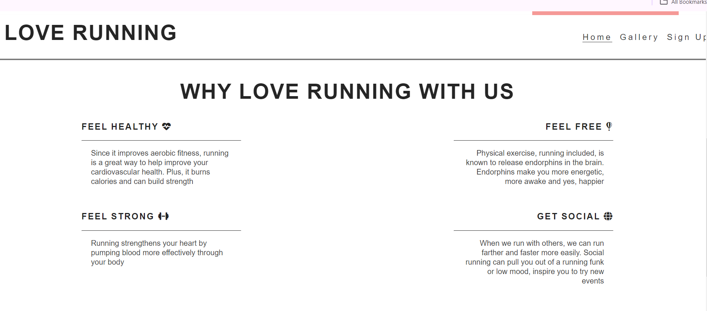
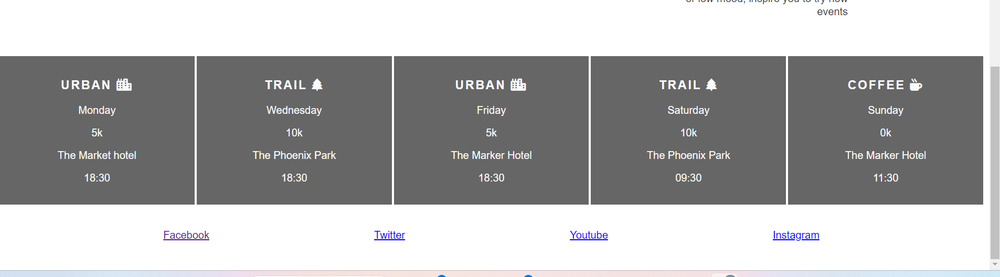
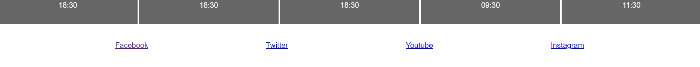

# Love Running Website
This project is titled Love Running. It is a site where people in Dublin that are interested in running can sign up and show their interest. The saying, together we achieve it is made to be real here. 

## Features

### Navigation
•	Several features in the navigation bar are the title, three navigation links: Home, Gallery and Signup.

•	The title shows the user what the site is all about. A click in the title bar will take you to the homepage.

•	The Home navigation link is also the home page. It shows the user at a glance all the information of the site.

•	The Gallery page shows the user the images of the previous runners of the film.
]
•	The Signup page is a page for sign up for interested candidates.

### Header

•	The header shows the title of the running club in Dublin. Eclipse colour was used.  

### Why Running with Us
•	This section shows the benefits of running with us. This will make the users to know how running with us will make them feel good.
•	Some of the benefits are “Feel Free”, “Feel Healthy”, “Feel Strong”, “Get Social”

### Meet up times
•	The meet up times shows the schedule to enable the users to know when and how to join.
•	It also shows the location in Dublin.  A background image was used to make it more attractive.

### Footer
•	This contain a navigation link for the users to be able to connect with us on social media. 
•	The social media used are Facebook, Instagram, Youtube. These will make the runners to stay connected to one another.

